# ⚡ AI Fit-Tech | NeonFit Elite

> **AI-Powered Fitness Coach providing real-time biomechanical analysis, automated session analytics, and adaptive corrective programming.**

---

## 🧩 1. Project Overview
NeonFit Elite is an end-to-end AI Fitness Coach that leverages computer vision (pose detection) and geometric state machines to solve the lack of personalized, real-time guidance in solo workouts. It doesn't just count reps; it analyzes the kinetic chain to ensure mastery of form and automated athlete progression.

## 🧩 2. Problem Statement
Many fitness enthusiasts fail to see results or suffer injuries due to:
- **Incorrect Exercise Form**: Small misalignments (e.g., knee cave in squats) go unnoticed.
- **Lack of Real-Time Feedback**: No one is there to say "go deeper" or "slow down" during a set.
- **No Personalized Guidance**: Users don't know what to do next based on their specific technical weaknesses.

## 🧩 3. Solution Overview
NeonFit Elite transforms a standard webcam into a high-fidelity biomechanical lab:
- **Real-time Tracking**: 33-point anatomical landmark detection via MediaPipe.
- **Form Correction**: Instant geometric analysis of joint angles and spine alignment.
- **Deep Analytics**: Post-session breakdowns of speed, score, and technical precision.
- **Adaptive AI Coaching**: A decision-making engine that generates personalized 7-day protocols and identifies CNS fatigue.

## 🧩 4. Core Features

### 🎯 Tracking System
- **Biomechanical Pose Detection**: Sub-millisecond tracking of 33 key anatomical landmarks.
- **Hysteresis-Based Rep Counting**: Uses stable frame thresholds and "extended → flexed → extended" state cycles to prevent double-counting or skipped reps.

### 🧍 Form Correction
- **Posture Detection**: Real-time monitoring of spine curvature (spine angle logic).
- **Incomplete Rep Detection**: Geometric triggers that warn when Range of Motion (ROM) falls below set thresholds (e.g., not squatting deep enough).

### 📊 Analytics
- **Per-Exercise Metrics**: Granular tracking of Rep Speed (ms/rep), Form Score (0-100), and technical rating.
- **Trend Analysis**: Longitudinal session scoring and performance delta calculation (+/- performance shifts).

### 🤖 AI Coach
- **Weak/Strong Identification**: Automated detection of "Critical Focus" areas based on historical form metrics.
- **Fatigue Detection**: Detects CNS fatigue by correlating performance drops with increased movement velocity (rushing).

### 📅 Workout Planner
- **Weak-Area Prioritization**: Generates 7-day corrective protocols targeting the athlete's most unstable kinetic chains.
- **Goal-Based Prescriptions**: Auto-adjusts sets/reps based on user goals (Muscle Gain: 10 reps | Endurance: 15 reps).

### 🔥 Habit System
- **Consistency Quotient**: A 0-100 score measuring regularity against weekly training targets.
- **Achievement Badges**: Tiered rewards (7-Day Warrior, Consistency King) to drive long-term retention.

## 🧩 5. System Architecture
The platform is built as a modular feedback loop ensuring data flows seamlessly from the camera to the training plan:

```mermaid
graph LR
    Camera[Camera Feed] --> Pose[MediaPipe Landmarks]
    Pose --> Engine[Rep State Machine]
    Engine --> Form[Form Analysis]
    Form --> Scoring[Biomechanical Scoring]
    Scoring --> Analytics[Session History]
    Analytics --> Coach[AI Coach Engine]
    Coach --> Planner[7-Day Planner]
    Planner --> UI[Adaptive Dashboard]
```



## 🧩 6. Tech Stack
- **Languages**: JavaScript (ES6+ Modular Architecture), HTML5, CSS3 (HSL Custom Design System).
- **Computer Vision**: Google MediaPipe (@mediapipe/tasks-vision).
- **Persistence**: Browser LocalStorage with JSON-based history indexing.
- **Tooling**: Vite for fast HMR and optimized build cycles.

## 🧩 7. Project Structure
```text
frontend/
├── js/session/
│   ├── repExercise.js     # Core Rep State Machine (Hysteresis Logic)
│   ├── coachEngine.js     # Decision-making & Advice Synthesizer
│   ├── workoutPlanner.js  # Corrective Protocol Generator
│   ├── habitSystem.js     # Persistence & Consistency Scoring
│   └── sessionApp.js      # Main Controller & UI Sync
└── index.html             # High-Fidelity Glassmorphism Dashboard
```

## 🧩 8. Key Engine Explanations

### 🦾 Rep Engine (Hysteresis)
Unlike simple "line crossing" logic, our engine uses **Stability Frames**. It requires the joint to stay within a threshold (Flexed/Extended) for $N$ consecutive frames before transitioning states. This filters out noise and ensures full Range of Motion (ROM).

### 🤖 Coach Engine (Adaptive)
The coach uses **Performance Deltas**. By comparing your current session score and average speed against your previous results, it can distinguish between "Lazy Form" and "Fatigue," providing corrective advice rather than generic motivation.

### 📅 Planner (Corrective)
The planner uses **Normalization Regex** to map exercise weaknesses to a corrective protocol dictionary. If your "Pushup" form is poor, it prescribes specific stability work (e.g., Incline Pushups, Planks) for the next 7 days.

## 🧩 9. Unique Points
- **Not Just a Counter**: Most apps count reps; NeonFit Elite coaches the *quality* of those reps.
- **Full Feedback Loop**: Data doesn't just sit in a graph; it directly influences your next workout plan.
- **Scalable Design**: The modular architecture allows adding new biometric definitions without rewriting the core engine.

## 🧩 10. How To Run
1. **Clone & Setup**:
   ```bash
   git clone https://github.com/Rajommkar/AI-fit-tech.git
   cd AI-fit-tech/frontend
   ```
2. **Install Dependencies**:
   ```bash
   npm install
   ```
3. **Run Dev Server**:
   ```bash
   npm run dev
   ```
4. **Access**: Open `http://localhost:5173` in a Chrome/Edge browser.

## 🧩 11. Screenshots
*Note: High-fidelity screenshots of the Neon Dashboard, AI Coach Advice, and Profile History.*


## 🧩 12. Future Improvements
- **Generative AI Integration**: Using LLMs to provide conversational, long-form fitness coaching.
- **Mobile PWA**: Expanding the MediaPipe implementation for low-latency mobile device use.
- **Voice-Activated Coaching**: Hands-free session control and real-time audio corrections.

## 🧩 13. Author
**[Rajommkar]**
GitHub: [Rajommkar](https://github.com/Rajommkar)

---
*Developed with a focus on System Architecture and Biomechanical Precision.*
