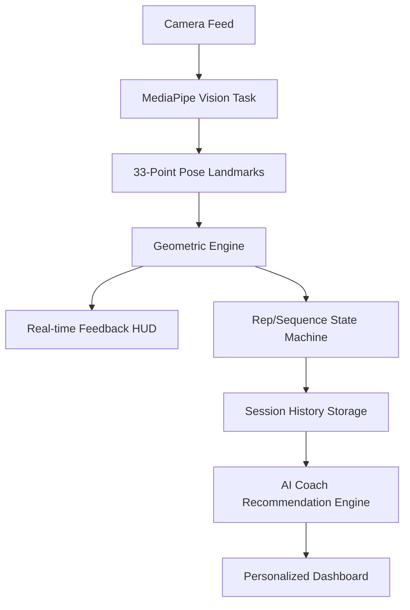

# ⚡ AI Fit-Tech | NeonFit Elite

> **Real-time biomechanical analysis and autonomous coaching powered by advanced computer vision.**

NeonFit Elite is a professional-grade fitness platform that leverages MediaPipe and custom geometric algorithms to provide instant posture correction, rep counting, and personalized AI-driven coaching.

## 🚀 System Architecture



## 🔹 Core Features

### 🧪 Biomechanical Analysis
- **33-Point Geometric Tracking:** Advanced anatomical landmark detection using MediaPipe.
- **Form Correction:** Instant feedback on joint angles, spine alignment, and kinetic chain stability.
- **Velocity Tracking:** Real-time motion speed analysis to target specific muscle fiber recruitment (TUT).

### 🤖 Autonomous AI Coach
- **Data-Driven Insights:** Personalized advice based on historical performance trends and session density.
- **Biomechanical Scoring:** Every rep is rated on a 100-point precision scale.
- **Neural Streak System:** Motivational logic that adapts coaching tone based on consistency.

### 📊 Professional Dashboards
- **Live Telemetry Stream:** Real-time joint angle and stability HUD.
- **Session Breakdown:** Detailed analytics on per-exercise performance, speed, and precision.
- **Athlete History:** Long-term trend analysis with automated "Neural Sync" metrics.

## 🛠️ Technology Stack

- **Frontend:** Vanilla JavaScript (ES Module Architecture), Vite, CSS3 (HSL Design System).
- **Computer Vision:** @mediapipe/tasks-vision.
- **Backend:** FastAPI (Python) for exercise definitions and data persistence.
- **Design:** Custom glassmorphism system with cursor-reactive micro-animations.

## 🏁 How to Run

1. **Frontend Setup:**
   ```bash
   cd frontend
   npm install
   npm start
   ```
2. **Backend Setup (Optional):**
   ```bash
   cd backend
   pip install -r requirements.txt
   python main.py
   ```

---
*Developed for elite performance tracking and musculoskeletal injury prevention.*
